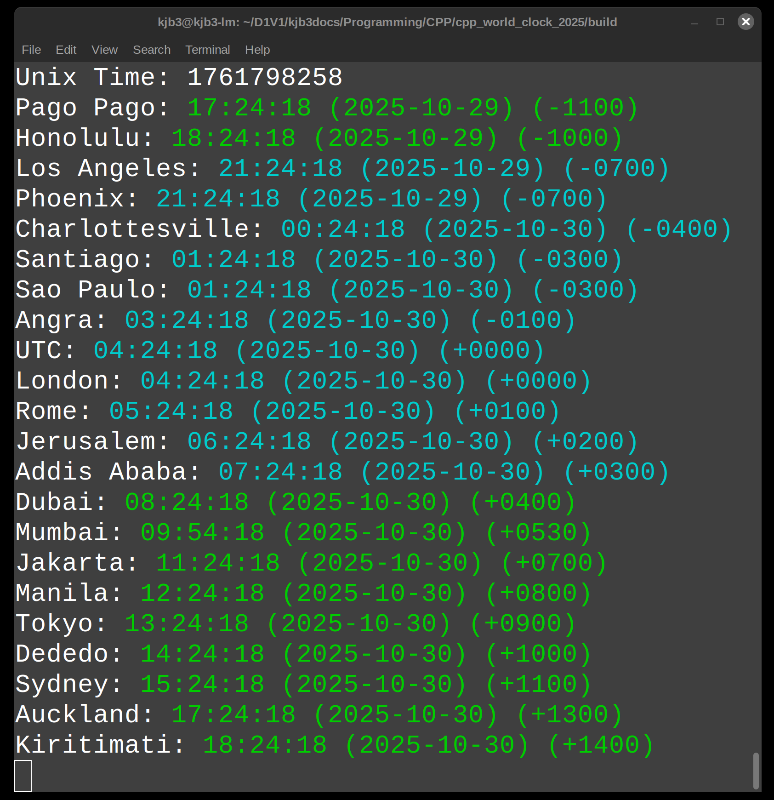

# Console World Clock (2025 Edition)

By Kenneth Burchfiel

Released under the MIT License

*Note: This program, like all of my other programs, was created *without* the use of generative AI tools.*

This simple C++ command-line-interface program displays the current time and date for a list of user-specified time zones. Times will appear in green if they're later than or equal to 8:00:00 and earlier than 20:00:00; all other times will appear in cyan.

The source code makes extensive use of [ANSI escape codes to control](https://en.wikipedia.org/wiki/ANSI_escape_code) the color and display of each time zone.

## Setup instructions

1. Compile the program, either using CMake or directly via a compiler like G++. (I have only tested it on Linux, but it should work on Windows and Mac as well--perhaps with a few tweaks.)

    (Note: the code expects the executable to be located in a /build subfolder and **not** the project's root folder!)

2. Update the tz_list.csv file as needed in order to specify which time zones you would like to display. (You can choose any number of time zones as long as you specify at least one; however, the output may not display correctly if there's not enough space on your monitor to show all of them.) 

    Within this CSV file, the first row shows time zone database entries ([available here](https://en.wikipedia.org/wiki/List_of_tz_database_time_zones), and the second row shows the labels you'd like to assign to those entries. (These labels can include spaces, but they must not include commas.) World times will be displayed in the order that they're entered within this database. 

    [This map](https://upload.wikimedia.org/wikipedia/commons/8/88/World_Time_Zones_Map.png) can help you identify which time zones you might want to add to your program.

3. Run the program by navigating to the /build folder and then executing it from there. 