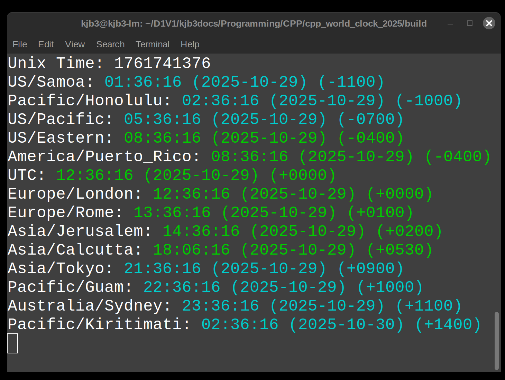

# Console World Clock (V2) [Work in progress]

By Kenneth Burchfiel

Released under the MIT License

This simple C++ program displays the current time and date for a variety of time zones. I plan to update it soon to allow the user, via a configuration file, to specify which [time zones](https://en.wikipedia.org/wiki/List_of_tz_database_time_zones) to include.

This program, like all of my other programs, was created *without* the use of generative AI tools.
