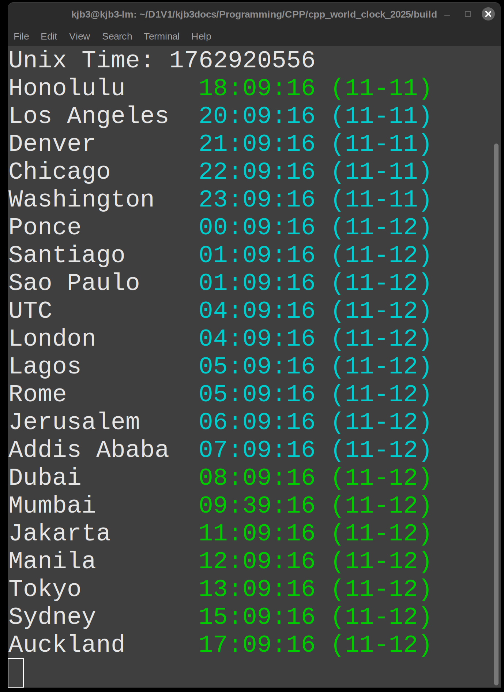
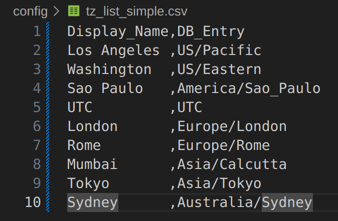
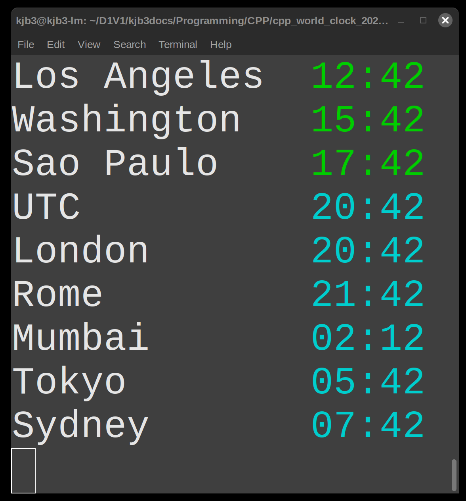
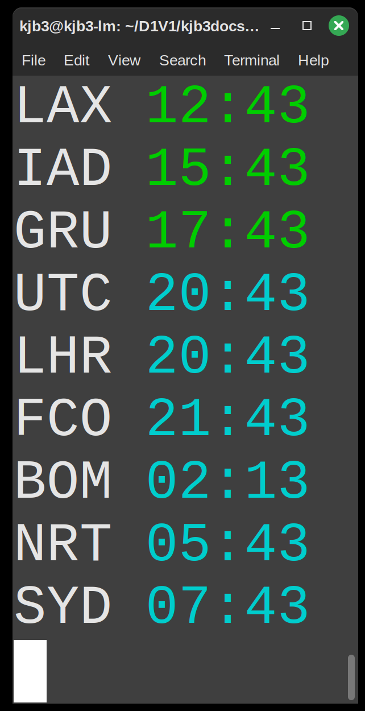
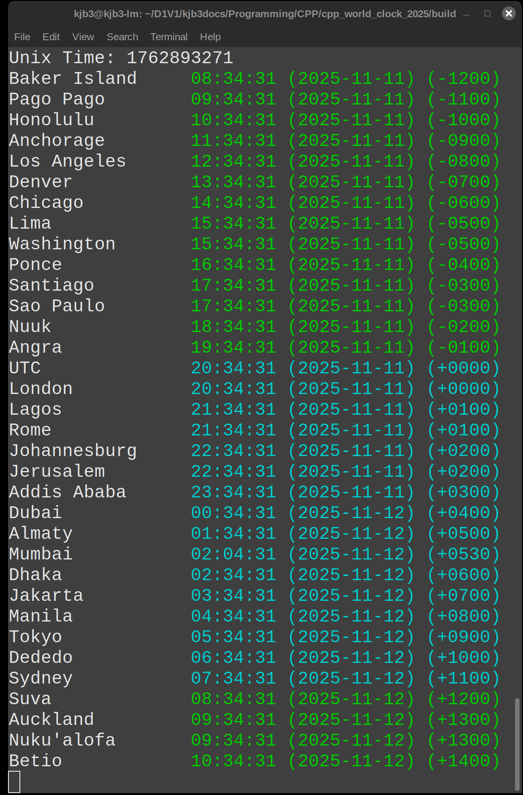
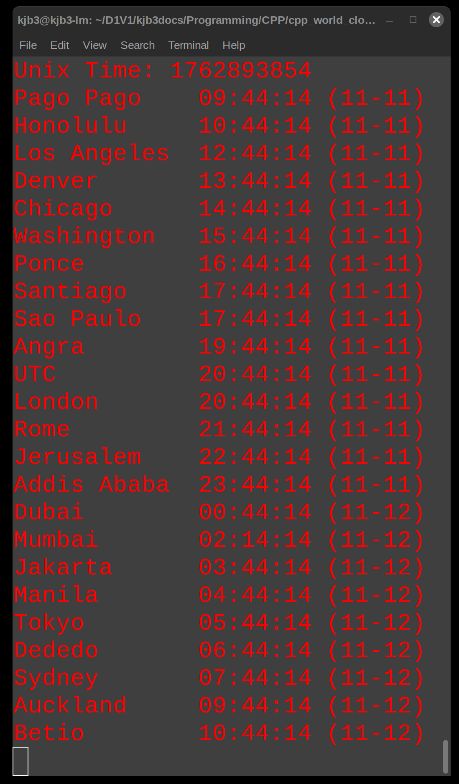
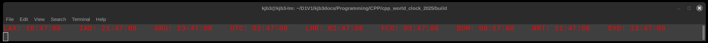
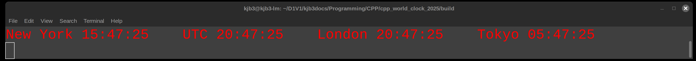

# Console World Clock (2025 Edition)

By Kenneth Burchfiel

Released under the MIT License

*Note: This program, like all of my other programs, was created \*without\* the use of generative AI tools.*

**Latest versions:**
* **Linux**: 2.4.0
* **Windows**: 2.4.0



**Console World Clock 2025** (CWC25) is a simple C++ command-line-interface program that displays the current time and date for a list of time zones that you specify. You're also able to customize many aspects of the output, including what colors to use for different components and how much detail to display.

By default, times will appear in green if they're later than or equal to 8:00:00 and earlier than 20:00:00; all other times will appear in cyan. You can choose different colors and cutoff times than these if you wish, however.

The source code makes extensive use of [ANSI escape codes](https://en.wikipedia.org/wiki/ANSI_escape_code) to control the color and display of each time zone.


## Setup instructions

1. If you'd like to download an executable for Windows or Linux, you can do so on Itch.io at https://kburchfiel.itch.io/console-world-clock. alternatively, you can compile the program yourself (see instructions below). 

    [Note: I encountered issues with compiling this program for MacOS, as the `zoned_time` function wasn't recognized by the laptop's version of Clang/G++. I hope to eventually release a MacOS version, but it may not come out for a while.]

2. Navigate to the build/ folder within your terminal, then launch the executable. On Linux, you can do so via the following command line entries: 

```
cd /home/your_username/Downloads/cpp_world_clock_2025/build
./cwc25
```

**Note**: If you try to launch the program from another folder, it likely won't work correctly, as it uses relative paths to locate certain configuration files. (More on these files below.)

On Windows, you would use the following steps:

```
cd C:\\Users\your_username\Downloads\cpp_world_clock_2025\build
cwc25.exe
```

(You should also be able to double-click the executable on Windows instead of navigating to the build folder.)

(Make sure to replace the path to the program folder with your own path as needed.)

 The program will show, by default, the time, month, and date for 23 cities around the world along with the current Unix Time. However, there are many ways to customize its output, either via pre-existing configuration files or ones that you create yourself.

You can resize the terminal as needed to accommodate your own time zone list and configuration settings. **(If not all of the time zones can be displayed, the program may not operate correctly; you should be able to resolve this by increasing your terminal's height and/or using a smaller font size.)**

While it's most convenient to just have it on the side of your current screen, you could also dedicate an entire external monitor to it if you'd like!


## Configuration instructions

Configuring CWC25 is very easy once you get the hang of it! When the program launches, it will load two filenames stored in /config/cwc_config.csv:

1. A .csv file containing time zones
2. A .csv file containing configuration settings

Thus, in order to update the program's output, you'll need to replace the existing filenames within this document with your preferred ones. A number of alternative time zone and config files are already present in the /config folder, but you can create your own also.

### Updating time zones

When creating a new .csv file for the time zones you wish to display, you can use one of the existing files (such as tz_list_default.csv) as a guide. You can choose any number of time zones as long as you specify at least one; however, the output may not display correctly if there's not enough space on your monitor to show all of them.

Within your CSV file, the first column should show the labels you'd like to assign to each entry, and the second column should show their corresponding time zone database names ([available here](https://en.wikipedia.org/wiki/List_of_tz_database_time_zones)). These labels can include spaces, but they must not include commas. World times will be displayed in the order that they're entered within this database. 

[This map](https://upload.wikimedia.org/wikipedia/commons/8/88/World_Time_Zones_Map.png) can help you identify which time zones you might want to add to your program.

For instance, an entry for Washington, DC could be entered as follows:

`Washington,America/New_York`

(If you're updating this .csv file within a spreadsheet editor, simply add `Washington` to the first cell and `America/New York` to the second one.)

Washington, like most cities, doesn't have its own time zone database entry, which is why we're using New York (another city within the same US Eastern time zone) instead.

You can replace 'Washington' with a value of your choice, such as an airport code:

`IAD,America/New_York`

Note that the first row of all configuration files, including time zone lists, will be skipped by the program, as it's expected to be a header row.

#### Tabbed output

If you would like time entries to line up with one another, simply add tabs/spaces to these files as needed. This may be easier within a text editor like VS Codium:



### Updating configuration settings

To update your configuration settings, I recommend making a copy
of the CSV file containing the program's default settings (config_list_default.csv), then adjusting the settings accordingly.

**Notes**: 

1. CWC 2.3 and onward support [the following 16 'classic' ANSI escape code colors](https://en.wikipedia.org/wiki/ANSI_escape_code#3-bit_and_4-bit):

    `blue`; `magenta`; `cyan`; `gray`;
    `bright black`; `bright red`; `bright green`; `bright yellow`; 
    `bright blue`; `bright magenta`; `bright cyan`; and `bright gray`

    However, other colors may be available as well depending on your terminal. For instance, to access a broader 256-color palette, you can try entering `38:5:x`, where `x` corresponds to one of the 256 colors within [this section of Wikipedia's article on ANSI escape codes](https://en.wikipedia.org/wiki/ANSI_escape_code#8-bit).

    For instance, I was able to get a purple color to display on Gnome Terminal within Linux Mint by entering `38:5:91` in lieu of one of the above 16 codes. However, these alternative codes may not work on your own OS/terminal combo.

1. To adjust color values for pre-2.3 versions of CWC, you'll need to enter the ANSI escape code that corresponds to your desired foreground color. A list of these codes can be found at https://en.wikipedia.org/wiki/ANSI_escape_code#Colors . For instance, if you would like to make daytime colors yellow, set the daytime_color setting to 33 (the foreground color for yellow).

2. For boolean (yes/no) entries, enter `true` for yes and `false` for no--not True, FALSE, 'true', "false", etc.

    **Warning:** Certain spreadsheet editors might try to 'help' you by changing 'false' to FALSE and 'true' to TRUE. However, since the program expects these codes to be lowercase, this will cause issues when running CWC. You can bypass this issue by using a text or code editor (like Notepad or VSCodium) instead.

3. Make sure not to add any spaces before or after configuration variables or values--or the commas that separate them. (For example, you can enter `entry_name_color,37`, but *not* `entry_name_color, 37`.)

Here are the following configuration settings that you can specify, along with their values in config_list_default.csv:


#### Settings for Versions 2.0.0+

1. `daytime_start`: an integer corresponding to the first hour to which you would like to assign 'daytime' colors to times. 
1. `daytime_end`: an integer one greater than the *last* hour to which you would like to assign 'daytime' colors to times. 

    The default settings for daytime_start and daytime_end mean that all times greater than or equal to 8:00:00 (i.e. 8 AM) and *less* than 20:00:00 (i.e. 8 PM) will be assigned the daytime color that you specify; meanwhile, all other times (e.g. 20:00:00 to 7:59:59) will be assigned the nighttime color.

    If, for instance, you would like to limit daytime colors to the 9-5 range, use 9 and 17 as your daytime_start and daytime_end values, respectively.

1. `entry_name_color`: the color in which to display time zone names. (See notes above for guidance on adjusting these colors.)

1. `daytime_color`: the color to assign to daytime values (as specified by daytime_start and daytime_end). 
1. `nighttime_color`: the color to assign to nighttime values.

    By the way, if you want all times to use the same color, simply use the same color code for both `daytime_color` and `nighttime_color`.

1. `unix_time_name_color`: the color to assign to the 'Unix Time' name.
1. `unix_time_color`: the color to assign to the Unix Time value.

    Note that `unix_time_color` is *not* affected by your daytime/nighttime color settings.

1. `show_unix_time`: whether or not to show the current Unix Time.
1. `show_seconds`: whether or not to show seconds in addition to hours and minutes. 
1. `show_year`: whether or not to show the year, in YYYY format, for each timestamp.
1. `show_date`: whether or not to show the date (in MM-DD format). 
1. `show_offset`: whether or not to show the time zone offset codes for each time zone.
1. `horizontal_display`: whether or not to display times horizontally rather than vertically.

#### Settings for versions 2.2.0+
1. `date_before_month`: whether or not to display dates before months (e.g. 3-4 instead of 4-3 for April 3). 
    Note: if `date_before_month` and `show_year` are both set to true, years will be placed after the month (e.g. 3-4-2025 for April 3, 2025); when `date_before_month` and `show_year` are set to false and true, respectively, years will be shown before the month (e.g. 2025-04-03).
1. `use_custom_format`: Set to `true` to use your own custom format rather than one created through the `show_seconds`, `show_year`, `show_date`, `show_offset`, and `date_before_month` commands.
1. `custom_format_code`: The custom format code that you would like to use for displaying times. For instance, the code `{:%Y-%m-%dT%H:%M:%S%z}`, will display times in ISO8601 format (e.g. 2025-11-11T15:11:20-0400). The documentation at https://en.cppreference.com/w/cpp/chrono/zoned_time/formatter.html will be a helpful resource when specifying new format codes.

#### Settings for versions 2.4.0+
1. `debug`: Set to `true` to show the number of microseconds required to render each set of times. This is more of an informational setting than a true debug option, but it can be an interesting benchmark nonetheless. (For instance, I found that times took around 4x longer to render on Windows than on Linux, even though I used the same laptop (via a dual-boot setup) for each trial.) 

### Examples

Here are examples of what the program will look like when different .csv files in the config/folder are passed to cwc_config.csv. By further customizing these files, though, you can create even more variations!

(These screenshots were taken on GNOME Terminal v 3.52.0; output on other terminals will likely differ at least somewhat.)

**Simplified output:**





**More detailed output:**



**All-red output:** (Useful for darkrooms, mission control centers, situation rooms, etc.)



**Horizontal output:** (Useful if you'd like to place the output at the top of your monitor)



**Simpler horizontal output:**



## Compilation instructions

To compile the program, you can use CMake with the included CMakeLists.txt file. Simply create a 'build' folder within your project's root folder; navigate to the 'build' folder within your terminal; and run:

`cmake ..`

`cmake --build .` (Don't forget the period at the end!)

Alternatively, you can also try to create an executable within the command line using a compiler of your choice. For instance, to compile the program with g++ on Linux, navigate to the project's root folder, make a build directory, and then run: 

`g++ cpp_world_clock.cpp -std=c++20 -o build/cwc25`

The Clang command is almost identical:

`clang++ cpp_world_clock.cpp -std=c++20 -o build/cwc25`

(Note: the program will only run correctly if the executable is stored in a /build subfolder and **not** the project's root folder.)

As noted earlier, I was not able to compile this program on MacOS, as the compiler on the laptop I was using didn't appear to support the `zoned_time()` function.
    
## Special thanks

Special thanks to Howard Hinnant for his hard work on C++'s chrono library--and for his thorough StackOverflow answers, without which I wouldn't have been able to get the project to its current state!

Also, special thanks to Klaus Alexander for his [insightful feedback](https://www.reddit.com/r/commandline/comments/1ou1l87/comment/no8vj0z/?utm_source=share&utm_medium=web3x&utm_name=web3xcss&utm_term=1&utm_content=share_button) on version 2.1.0 of this project. Many of the improvements in version 2.2.0 are in response to his feedback.

## Dedication

This project is dedicated to our son, Kenneth. I hope he comes to enjoy programming as much as I do!